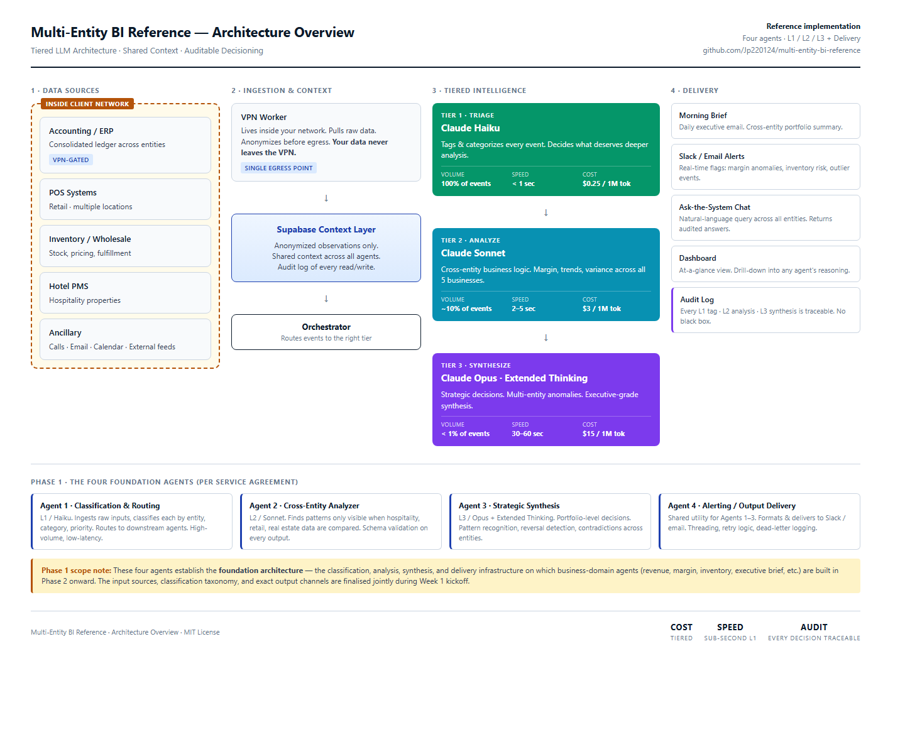

# multi-entity-bi-reference

A reference implementation of a **tiered-LLM multi-agent system** for cross-entity business intelligence. Demonstrates how to orchestrate Claude Haiku, Sonnet, and Opus across a shared context layer with schema validation, auditable decisioning, and clean separation between agents.

Generic domain: a hypothetical portfolio business with retail and hospitality entities across multiple locations. The patterns transfer to any multi-entity organization where signals must be classified, cross-referenced across business units, and synthesized into executive-grade briefings.

Built by [Priyanshu Kumar](https://www.linkedin.com/in/priyanshu-axiom) — previously built a production multi-agent system for Amazon Merch intelligence.



A full sample run against the live Anthropic API — input, output
briefing, and cost breakdown — is in [`docs/sample_run.md`](docs/sample_run.md).

---

## Why This Exists

Large multi-entity businesses sit on fragmented data: a POS system here, an ERP there, a hotel PMS, a CRM, scattered spreadsheets. The operator-level insight is usually not in any single system — it emerges only when events across entities are *compared*.

A naive approach — one LLM call per event — burns money and produces shallow output. A tiered approach, where each model tier does what it is best at, produces better output at a fraction of the cost:

| Tier | Model | Role | Volume | Speed | Input / Output (per 1M tokens) |
|------|-------|------|--------|-------|--------------------------------|
| L1 | Haiku 4.5 | Triage · classify every event | 100% | < 1 s | $1 / $5 |
| L2 | Sonnet 4.6 | Analyze · cross-reference entities | ~10% | 2–5 s | $3 / $15 |
| L3 | Opus 4.7 + Extended Thinking | Synthesize · strategic briefings | < 1% | 10–60 s | $5 / $25 |
| L4 | *(shared utility)* | Deliver · Slack / email / dashboards | — | — | — |

Rates sourced from [Anthropic's public pricing](https://docs.anthropic.com/en/docs/about-claude/pricing); the actual rate card used by the cost estimator is in `agents/base.py` and can be overridden for custom enterprise pricing.

---

## The Five Design Axes

This repository is organized around the five criteria that any production multi-agent BI system must answer. Each is addressed explicitly below and demonstrated in code.

### 1 · Quality

- Every Claude call is schema-validated on the way in and the way out via Pydantic models (`schemas/`)
- Automated test suite covers unit behavior per agent and integration across the L1 → L2 → L3 flow (`tests/`)
- Structured logging at every tier, every context write, every LLM call
- Type-checked with mypy in strict mode; formatted with ruff; no untyped external data touches business logic

### 2 · Cost Discipline

- Model tier is explicit at the agent boundary. No agent can silently upgrade itself to Opus.
- Token cost estimators embedded at every tier (`agents/base.py::estimate_cost`)
- Extended Thinking on the L3 tier is budgeted per call (configurable, default 8 000 tokens) rather than unbounded
- Empirical per-run cost summary emitted by the orchestrator after every end-to-end pass

### 3 · Security

- No credentials committed to the repo. `.env.example` documents the required variables.
- The orchestrator supports a **VPN-gated pattern**: a worker runs inside the client network, pulls raw data, anonymizes it, and only writes sanitized observations to the shared context layer.
- Context writes are tagged by entity so cross-entity access is an explicit query, not an accidental side-effect.
- No PII flows into LLM prompts by default — all upstream extractors are expected to anonymize before writing to the context layer.

### 4 · Modifiability

- `agents/base.py` defines an abstract `Agent` interface. All four Phase-1 agents implement it.
- Adding a new agent is one file + one registration line. No changes to the orchestrator, the context store, or any other agent.
- The context store is an interface (`context/store.py`). SQLite is the default for local development; Supabase / Postgres implementations can be swapped in by subclassing.

### 5 · Forward-Evolvability

- The L1 / L2 / L3 tiered structure is the foundation for extending from four agents to thirty-plus without redesign.
- Every new agent plugs into the same classification → analysis → synthesis → delivery pipeline.
- Phase-2 business-domain agents (revenue, margin, inventory, executive brief) are expected to inherit from the same `Agent` base class and write to the same context schema.

---

## Repository Layout

```
multi-entity-bi-reference/
├── agents/
│   ├── base.py            # Abstract Agent interface
│   ├── l1_classifier.py   # L1 · Haiku · classify + route
│   ├── l2_analyzer.py     # L2 · Sonnet · cross-entity analysis
│   ├── l3_synthesizer.py  # L3 · Opus + Extended Thinking
│   └── l4_delivery.py     # Output / alerting utility
├── context/
│   ├── store.py           # Shared context layer (SQLite default, swappable)
│   └── schema.sql         # Tables: events, classifications, analyses, audit_log
├── orchestrator/
│   └── router.py          # Routes events through the tiers
├── schemas/
│   └── models.py          # Pydantic models for LLM boundary validation
├── examples/
│   └── demo_run.py        # End-to-end working example
├── tests/
│   ├── test_l1_classifier.py
│   ├── test_l2_analyzer.py
│   ├── test_schema_validation.py
│   └── test_integration_l1_l2_l3.py
├── docs/
│   └── architecture.md    # Architecture decisions and diagrams
├── pyproject.toml
├── .env.example
├── LICENSE
└── README.md
```

---

## Quick Start

```bash
# Clone
git clone https://github.com/Jp220124/multi-entity-bi-reference.git
cd multi-entity-bi-reference

# Install
pip install -e ".[dev]"

# Configure
cp .env.example .env
# Edit .env and set ANTHROPIC_API_KEY

# Run the tests (uses mocked Anthropic client — no API calls)
pytest -v

# Run the demo end-to-end (uses the real Anthropic API — set your key)
python examples/demo_run.py
```

`pytest` discovers the tests via the repo-root `conftest.py`, so the
test command works immediately after `git clone` without waiting for
editable install.

---

## End-to-End Flow

```
    Raw event
        │
        ▼
┌───────────────────┐
│ L1 · Haiku        │  classify by entity, category, priority
│ Classifier        │  write classification to context
└────────┬──────────┘
         │ routine → stop
         │ notable → L2
         │ urgent  → L3
         ▼
┌───────────────────┐
│ L2 · Sonnet       │  cross-reference across entities
│ Analyzer          │  detect patterns invisible in isolation
└────────┬──────────┘
         │ confirmed pattern → L3
         │ no pattern        → stop
         ▼
┌───────────────────┐
│ L3 · Opus         │  synthesize portfolio-level briefing
│ Synthesizer       │  extended thinking (8k tokens default)
└────────┬──────────┘
         ▼
┌───────────────────┐
│ L4 · Delivery     │  format + dispatch to Slack / email
└───────────────────┘
```

Every tier writes its reasoning to the audit log. At any point you can trace an output back through every decision that produced it.

---

## What This Is *Not*

- This is a **reference implementation**, not a commercial product.
- The demo domain is generic. Real-world integration with source systems (QuickBooks, Sage Intacct, hotel PMS, POS, etc.) is an engagement concern, not something the reference repo ships with.
- No UI. This is a backend orchestration reference.

---

## License

MIT. See [LICENSE](./LICENSE).

---

## Contact

Priyanshu Kumar · [LinkedIn](https://www.linkedin.com/in/priyanshu-axiom)
